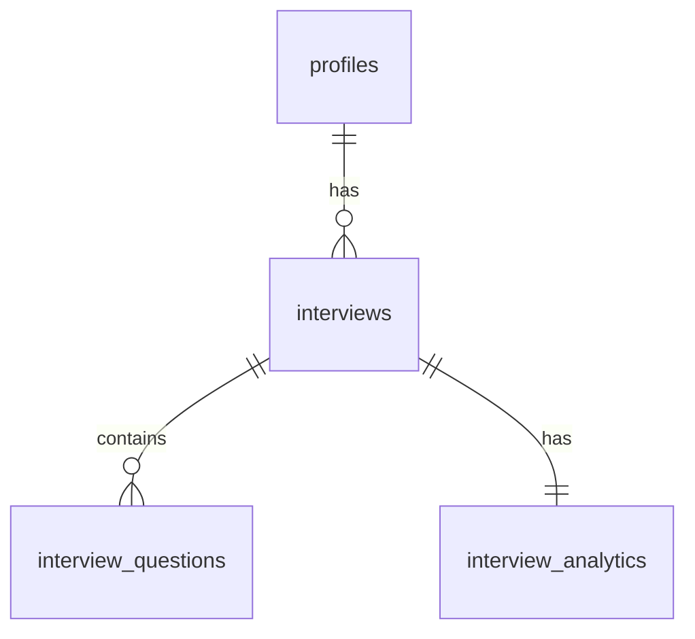

# Project Overview

## About the Project

IntervAI is a full-stack AI-powered mock interview platform built with Next.js 16. It helps job seekers and students practice technical and behavioral interviews with an AI interviewer powered by Kimi 2.6. Users configure their interview preferences — role, experience level, skills, and question types — and engage in realistic, timed mock interviews that adapt to their answers in real-time. After each session, users receive detailed analytics including overall scores, clarity, relevance, technical depth, and confidence metrics, along with personalized feedback and improvement tips.

The platform includes a marketing landing page with pricing tiers, a comprehensive dashboard for interview management, live interview sessions with real-time feedback, a detailed history of past interviews, and in-depth analytics for performance tracking. The entire experience is designed to help users build confidence, improve communication, and land their dream jobs.

### Tech Stack Summary

| Layer | Technology | Version / Spec | Purpose |
| :--- | :--- | :--- | :--- |
| **Frontend** | React / Next.js (App Router) | React 19.2.4, Next.js 16.2.9 | UI, Routing, Client/Server rendering |
| **Styling** | Tailwind CSS | Tailwind v4.x | Responsive components and layout styling |
| **Backend** | Next.js Server Actions & Route Handlers | Next.js 16.2.9 | Business logic, API layer, and integration |
| **Database** | PostgreSQL | Latest version | Relational storage for profiles, sessions, questions |
| **Authentication** | Email Authentication | Email & password | User registration & login via email authentication |
| **AI Model** | Kimi 2.6 | API (OpenAI-compatible SDK) | Real-time mock interview evaluation and feedback generation |
| **Hosting** | Vercel / InsForge Infrastructure | Serverless Node.js | Deployment, hosting, and storage buckets |

### AI Integration

- **API Interface**: Called using the official OpenAI Node.js SDK (or OpenAI-compatible API client) configured with a custom `baseURL` (pointing to Kimi API endpoint) and `apiKey`.
- **Streaming Support**: Real-time response streaming (`stream: true`) is utilized for generating questions and feedback to reduce Time to First Token (TTFT) and provide a smoother user experience.
- **Model Parameters**: Temperature is set to 0.7 for creative and adaptive interview question generation, and 0.2 for structured, deterministic grading and feedback evaluation.

### Key Constraints

- **Fullscreen API**: Live interview sessions require entering fullscreen mode. Escaping, minimizing, or switching tabs immediately halts screen recording and terminates the interview.
- **Language**: English-only support for interviews, questions, resume processing, and feedback evaluation (MVP).
- **Responsive Web**: Mobile-optimized web interface (no native applications).
- **Infrastructure Tier**: InsForge serverless execution limits, database connection pool thresholds, and standard Kimi API rate limits apply.

---

## The Problem It Solves

Preparing for job interviews is one of the most stressful parts of the job hunt. Practicing with friends or family rarely replicates the pressure and technical depth of a real interview. Existing platforms are either too generic, lack real-time feedback, or don't provide actionable insights on where to improve.

IntervAI solves this by providing realistic, AI-driven mock interviews that simulate the actual interview environment. Users get instant feedback on their answers, detailed performance analytics, and personalized tips — all tailored to their specific role, experience level, and target skills. Whether it's a Frontend Developer preparing for React questions or a Backend Engineer brushing up on system design, IntervAI creates a customized practice experience that grows with the user.

---

## Pages

```
/                          → Landing page (marketing site)
/login                     → Auth page (Email Authentication)
/dashboard                 → Overview, stats, continue interview, recent performance, tips
/interview/new             → Start New Interview — configure role, skills, duration, question types
/interview/[id]            → Live interview session — AI interviewer chat, answer input, real-time feedback
/history                   → Interview history — past sessions, scores, filters, pagination
/analytics                 → Detailed analytics — score breakdowns, strengths, areas to improve, charts
/resume-builder            → Resume builder — generate professional PDF from profile data
/resources                 → Interview resources — tips, guides, and preparation materials
/settings                  → User settings — profile, preferences, notifications, billing
```

---

## Navigation

### Landing Page Navigation
Top navbar. Clean and minimal. Five navigation items plus auth:

```
Features    How it Works    Pricing    Testimonials    FAQ          Log in    Get Started →
```

### Dashboard Navigation
Left sidebar. Collapsible on mobile. Eight navigation items plus user profile:

```

📊  Dashboard
🕐  History
📈  Analytics
⚙️  Settings

[Powered by Kimi 2.6 AI card]
```

Top header bar: Kimi 2.6 badge, theme toggle, "Hello, [Name]" user dropdown with avatar.

Full-width layout on all dashboard pages. Sidebar persists across all app pages.

---

## Core User Flow

### Homepage

- Hero section with "Ace Every Interview with AI" headline
- Features grid: AI Mock Interviews, Real-time Feedback, Detailed Analytics, Custom Interviews, Resume & JD Support
- How it Works: 4-step process (Choose Your Role → Add Your Context → Start Interview → Get Insights & Improve)
- Testimonials section: "Loved by Job Seekers"
- Pricing section with monthly/yearly toggle
- CTA banner: "Ready to Ace Your Next Interview?"
- Footer with Product, Resources, Company, and Newsletter sections
- Logged in users → redirect to /dashboard
- Logged out users → CTA buttons redirect to /login

### Onboarding

- User signs up via Email Authentication
- On first login → redirect to /dashboard with incomplete profile banner
- User prompted to complete profile and select preferences

### Profile & Preferences Setup

- User fills basic profile: name, target role, experience level, primary skills
- User can upload their resume (PDF or DOCX) for context-aware interviews
- User can paste a job description to tailor interview questions to a specific role
- Two options on resume upload:
  - "Extract from Resume" → AI parses resume and auto-fills profile fields
  - "Skip" → resume stored as-is, profile unchanged
- User can manually edit any profile field at any time in Settings
- Resume Builder: generate a clean professional PDF resume from current profile data

### Starting a New Interview

- User clicks "Start New Interview" from dashboard or sidebar
- Step 1 — Interview Details:
  - Select Role / Position (e.g., Frontend Developer)
  - Select Experience Level (Junior, Mid Level, Senior)
  - Select Interview Type (Technical, Behavioral, Mixed)
  - Add Primary Skills (optional tags: React, JavaScript, TypeScript, CSS, etc.)
- Step 2 — Add Context (Optional):
  - Upload Resume (PDF, DOCX) — AI uses this to personalize questions
  - Paste Job Description — AI tailors questions to match the JD
- Step 3 — Customize Interview:
  - Select question sections: Technical Questions, Behavioral Questions, System Design, Coding Challenge
  - Question Focus dropdown: Mix of Conceptual, Practical, and Problem Solving
- Step 4 — Set Duration & Questions:
  - Total Duration: 15 / 30 / 45 / 60 Minutes
  - Number of Questions: 5 / 8-10 / 12-15 / 20
  - Time per Question (Average): 1-2 / 2-3 / 3-5 Minutes
- Right sidebar shows live Interview Summary with all selections
- User clicks "Start Interview" → launches live interview session

### Live Interview Session

- Interview page loads with configured settings and automatically enters/enlarges to full screen mode.
- Top info bar: Role, Difficulty, Interview Type, Time Remaining
- AI Interviewer avatar with "Speaking..." status indicator
- AI introduces itself and asks the first question
- Audio waveform visualization during AI speech
- User answer input area:
  - Text input: "Type or speak your answer here..."
  - "Speak Answer" button for voice input
  - "Submit Answer" button to send response
- Contextual tip below input: "Take your time. Think clearly before answering."
- Right sidebar: Questions panel showing all questions with status
  - Progress indicator: "3 / 8"
  - Status states: Answered (green check), Current (purple highlight), Pending (gray)
- Bottom action bar:
  - Live Analysis → opens real-time feedback panel
  - Interview Notes → add personal notes during session
  - Settings → adjust interview settings
- "End Interview" button available at all times
- Timer counts down automatically; interview ends when time expires or all questions answered
- Strict proctoring and security rules:
  - User is strictly prohibited from escaping full screen mode, minimizing the application, opening a new tab, or taking screenshots.
  - If any of these actions are detected, the screen recorder automatically stops and the user is immediately exited from the interview.

### Live Analysis (Real-time Feedback)

- Accessible during and after the interview
- Back to Interview button returns to live session
- Score cards with circular progress indicators:
  - Overall Score /100
  - Clarity /100
  - Relevance /100
  - Technical Depth /100
  - Confidence /100
- Qualitative labels: Good, Average, Excellent
- Strengths section: bulleted list of what the user did well
- Areas to Improve section: bulleted actionable suggestions
- Detailed Feedback per question:
  - Shows current question number (e.g., "Question 3 of 8")
  - AI-generated feedback on the specific answer
  - "View Answer" button to review what was submitted
- Speaking Pace analysis: waveform visualization + qualitative rating
- Confidence trend chart: line graph showing confidence trajectory across answers
- Right sidebar persists showing full question list with statuses

### Interview History

- Table view of all past interview sessions
- Search bar: "Search interviews..."
- Filter dropdowns: All Roles, All Types (Technical/Behavioral/Mixed), All Time
- Columns: Interview Name, Role, Type, Date, Duration, Score, Status, Action
- Each row shows:
  - Interview icon (varies by type: code, brain, JS, etc.)
  - Interview name and question count (e.g., "Frontend Developer Interview — 8 Questions")
  - Role badge
  - Type badge (Technical / Behavioral / Mixed)
  - Date and time
  - Duration
  - Score badge (color-coded: green 70+, yellow 50-69, red <50)
  - Status badge (Completed / In Progress / Incomplete)
  - Action button: "View Details" or "Continue"
- Pagination at bottom: 8-10 interviews per page
- Click any row → opens detailed interview analytics page

### Dashboard

- Welcome header: "Welcome back, [Name]! 👋" with personalized greeting
- "Start New Interview" primary CTA button
- Quick stats row: Role, Difficulty, Interview Type, Time per Interview, Questions
- Continue Interview card (if session in progress):
  - Interview name, current question, time remaining
  - Progress bar showing percentage completed
  - "Resume" button to jump back into the session
- Recent Performance section:
  - Circular chart showing average score (e.g., 72/100)
  - Stats: Average Score, Interviews Taken, Questions Answered, Total Time
  - Dropdown: "Last 5 Interviews" / "Last 10 Interviews" / "All Time"
- Upcoming Interview Tips:
  - AI-generated suggestions based on weak areas
  - Examples: "Review JavaScript fundamentals", "Practice React concepts", "Work on problem solving"
  - "View All" link to resources page
- Your Recent Interviews:
  - List of last 5 completed interviews with scores
  - Color-coded score badges
  - "View All" link to full history page

### Analytics Page

- Deep-dive performance analytics (post-interview or historical)
- Same layout as Live Analysis but for completed sessions
- Score breakdowns with visual indicators
- Strengths and areas to improve
- Per-question feedback with viewable answers
- Speaking pace and confidence visualizations
- Question-by-question review panel on the right


---

## Data Architecture

### Schema & Relationships



### User Profile Data (`profiles` table)

- **Fields**: id (UUID, Primary Key), name, email, avatar, target_role, experience_level, primary_skills[], resume_url, job_description_text
- **Relationships**:
  - `id` references `auth.users(id)` with `ON DELETE CASCADE` (managed by auth provider metadata link).
- **Notes**: Only changes when user explicitly edits profile or uploads resume and selects "Extract from Resume". Used to personalize interview questions and generate tips. Never modified by any interview session.

### Interview Session Data (`interviews` table)

- **Fields**: id (UUID, Primary Key), user_id (UUID, Foreign Key), role, experience_level, interview_type, skills[], duration, question_count, time_per_question, sections[], status, score, started_at, completed_at
- **Relationships**:
  - `user_id` references `profiles(id)` with `ON DELETE CASCADE`.
- **Notes**: Generated per interview when user clicks "Start Interview". Status enum: `in_progress`, `completed`, `abandoned`, `incomplete`. Score calculated upon completion based on AI evaluation of all answers.

### Question & Answer Data (`interview_questions` table)

- **Fields**: interview_id (UUID, Foreign Key), question_number (integer), question_text, user_answer, ai_feedback, scores_json, duration_seconds, created_at
- **Relationships**:
  - Compound Primary Key: `(interview_id, question_number)`.
  - `interview_id` references `interviews(id)` with `ON DELETE CASCADE`.
- **Notes**: `scores_json` contains: clarity, relevance, technical_depth, confidence, overall.

### Analytics & Feedback Data (`interview_analytics` table)

- **Fields**: id (UUID, Primary Key), interview_id (UUID, Foreign Key, Unique), overall_score, clarity_score, relevance_score, technical_depth_score, confidence_score, strengths[], areas_to_improve[], speaking_pace_rating, confidence_trend_data
- **Relationships**:
  - `interview_id` references `interviews(id)` with `ON DELETE CASCADE` (1-to-1 relationship).
- **Notes**: Aggregated from `interview_questions` per session. Used to populate dashboard Recent Performance and Analytics page.

---

## Features In Scope

- Landing page with hero, features, how it works, pricing, testimonials, FAQ, footer
- Top navbar on landing page: Features, How it Works, Pricing, Testimonials, FAQ, Log in, Get Started
- Left sidebar navigation on dashboard: Interview, Dashboard, History, Analytics, Resume Builder, Resources, Settings
- Email authentication (no OAuth 2.0)
- Redirect to /dashboard after login
- User profile setup with role, experience level, and skills
- Resume upload (PDF, DOCX) with optional AI auto-fill of profile fields
- Job description paste for context-aware interviews
- Start New Interview wizard — 4-step configuration flow
- Live AI interview session with chat interface
- Automatic browser section enlargement to full screen mode on interview launch
- Strict full screen compliance (escaping full screen, minimizing, tab switching, or screenshot attempts stops screen recording and exits the interview)
- AI interviewer avatar with speaking status indicator
- Text and voice answer input methods
- Real-time timer with countdown
- Question progress sidebar with status indicators (Answered, Current, Pending)
- Live Analysis panel with 5 score dimensions (Overall, Clarity, Relevance, Technical Depth, Confidence)
- AI-generated strengths and areas to improve
- Per-question detailed feedback with answer review
- Speaking pace visualization and rating
- Confidence trend line chart
- Interview History page with search, filters, sort, pagination
- Score color-coding (green/yellow/red) in history table
- Dashboard with welcome header, quick stats, continue interview, recent performance chart, interview tips, recent interviews list
- Analytics page with full score breakdowns and visualizations
- Settings page for profile, preferences, and account management
- Pricing page with Free, Pro ($19/mo), Team ($49/mo per user), Enterprise (Custom) tiers
- Monthly/Yearly billing toggle with 20% yearly discount
- 30-day money-back guarantee messaging
- PostHog event tracking throughout
- "Powered by Kimi 2.6 AI" branding in sidebar
- Theme toggle (light/dark mode)
- User dropdown with profile and logout

---

## Features Out of Scope

- Auto-apply to real jobs — platform is purely for practice
- Live video interview (face-to-face) — text and voice only
- Resume Builder — AI-generated professional PDF
- Resources page with curated interview prep conten
- Real human interviewer booking or scheduling
- Peer-to-peer mock interviews with other users
- LinkedIn integration or job board connections
- Company-specific interview question banks (only role/skill-based)
- Code editor / IDE integration for live coding challenges (questions are Q&A format only)
- Mobile native app — responsive web only
- Offline mode — requires internet for AI responses
- Multi-language interviews — English only for MVP
- Team collaboration features (shared dashboards, manager reviews) — beyond basic Team plan
- Advanced billing/subscription management portal (Stripe integration for Team/Enterprise is future scope)
- Email or push notifications for interview reminders
- Calendar integration for scheduling practice sessions
- Gamification / badges / leaderboards
- Community forum or discussion boards
- AI-generated cover letters
- Salary negotiation coaching module
- Third-party LMS integrations
- Browser extension
- White-label / custom branding for Enterprise

---

## PostHog Events

```typescript
interview_started; // { userId, role, experienceLevel, interviewType, duration, questionCount, sections[] }
question_answered; // { userId, interviewId, questionNumber, durationSeconds, inputMethod: 'text' | 'voice' }
interview_completed; // { userId, interviewId, overallScore, clarityScore, relevanceScore, technicalDepthScore, confidenceScore, totalDuration }
interview_abandoned; // { userId, interviewId, questionsAnswered, totalQuestions, reason: 'user_ended' | 'timeout' }
analysis_viewed; // { userId, interviewId, viewType: 'live' | 'post_interview' }
history_filter_used; // { userId, filterType: 'role' | 'type' | 'time', filterValue }
resume_uploaded; // { userId, fileType, usedForExtraction: boolean }
job_description_pasted; // { userId, interviewId, descriptionLength }
pricing_viewed; // { userId, plan: 'free' | 'pro' | 'team' | 'enterprise' }
settings_updated; // { userId, settingType: 'profile' | 'preferences' | 'notifications' }
```

---

## Target User Personas

| Persona | Description | Key Needs |
| :--- | :--- | :--- |
| **Free Tier User** (Job Seekers & Students) | Individuals practicing interview basics, standard Q&A, and evaluating the platform. | <ul><li>Access to standard question configuration (up to 5 questions).</li><li>Basic text and voice response input options.</li><li>Immediate overall session score with clarity rating.</li><li>Access to basic interview preparation tips.</li></ul> |
| **Pro Tier User** (Active Job Seekers) | High-intent candidates with active/upcoming job interviews who need high-fidelity simulations. | <ul><li>Context-aware questions tailored to uploaded resume (PDF/DOCX) or pasted job descriptions.</li><li>Multi-dimensional evaluation (Overall, Clarity, Relevance, Depth, Speaking Pace).</li><li>Full progress analytics dashboard with confidence trends.</li><li>One-click professional PDF resume generation.</li></ul> |

---

## Success Criteria

1. **Fast-path Onboarding**: A new user can complete email authentication, basic profile configuration, and launch a new mock interview session within 180 seconds.
2. **AI-Driven Personalization**: The Kimi 2.6 API successfully generates a list of N questions (where N is the configured question count) matching the chosen role, difficulty level, and skills.
3. **Multi-Dimensional Evaluation**: Every answered question receives an AI feedback payload containing five numeric metrics (Overall, Clarity, Relevance, Depth, Pace) in the range 0-100.
4. **State Persistence**: Saving a completed interview writes records to the `interviews`, `interview_questions`, and `interview_analytics` tables, making them immediately retrievable via history API filters.
5. **Context Integration**: Uploading a PDF resume or pasting a job description modifies the generated interview questions to reference specific candidate experience/skills.
6. **Interview Stability**: The session timer accurately counts down, and the user can step sequentially through all N questions without state loss or application crashes.
7. **Proctoring Enforcement**: Exiting browser fullscreen mode, switching active browser tabs, minimizing the browser window, or pressing screenshot hotkeys immediately invokes the `stopRecording` function and redirects the user to `/dashboard` with a proctoring violation status.
8. **Responsive Visualization**: Analytics charts render without visual clipping or overflow on screens ranging from 375px (mobile) to 1920px (desktop) width.
9. **Telemetry Completeness**: The application fires PostHog events (`interview_started`, `question_answered`, `interview_completed`, `interview_abandoned`, `analysis_viewed`) matching the exact payload schema for every corresponding user action.
10. **Session State Recovery**: Uncompleted or closed browser sessions persist in the DB with status `incomplete` or `abandoned`, allowing the user to resume them from the dashboard.
